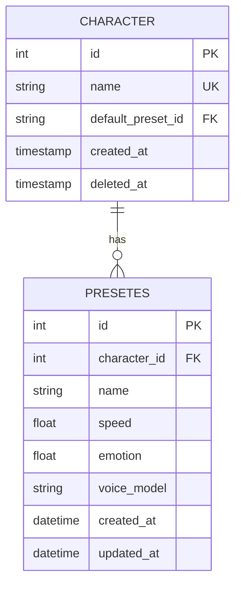

# DB設計
## **設計方針**  
- **SQLite を使用**し、データをリレーショナルに管理  
- **プリセット情報とキャラクターごとの設定を分割**（正規化）  
- **作成日時（created_at）と更新日時（updated_at）を全テーブルに追加**  
- **ログはファイルに保存**し、DBには保持しない  

---

## **テーブル設計**  

### **1. `characters`（キャラクター情報）**  
キャラクターごとの基本情報を管理  

| カラム名      | 型            | 主キー | NULL許可 | 説明 |
|--------------|-------------|------|------|----------------|
| `id`         | INTEGER     | PK   | NO   | キャラクターID（自動採番） |
| `name`       | TEXT UNIQUE | YES  | NO   | キャラクター名（ユニーク） |
| `default_preset_id` | INTEGER  | FK   | YES  | デフォルトプリセットのID（`presets.id` を参照） |
| `default_speed` | REAL | NO | NO | デフォルトの話速 |
| `default_emotion` | REAL | NO | NO | デフォルトの感情パラメータ |
| `created_at` | TIMESTAMP  | NO   | NO   | 作成日時 |
| `updated_at` | TIMESTAMP  | NO   | NO   | 更新日時 |

---

### **2. `presets`（プリセット情報）**  
キャラクターごとの音声設定プリセットを管理  

| カラム名      | 型        | 主キー | NULL許可 | 説明 |
|--------------|---------|------|------|----------------|
| `id`         | INTEGER | PK   | NO   | プリセットID（自動採番） |
| `character_id` | INTEGER | FK   | NO   | 所属キャラクターID（`characters.id` を参照） |
| `name`       | TEXT    | NO   | NO   | プリセット名 |
| `speed`      | REAL    | NO   | NO   | 話速 |
| `emotion`    | REAL    | NO   | NO   | 感情パラメータ |
| `voice_model` | TEXT   | NO   | NO   | 使用する音声モデル |
| `created_at` | TIMESTAMP  | NO   | NO   | 作成日時 |
| `updated_at` | TIMESTAMP  | NO   | NO   | 更新日時 |

- **`character_id` は `characters` テーブルを参照**
- **1キャラに対して複数のプリセットを持てる**

---

### **ER図（Mermaid記法）**  

---

### **データの例**
#### **キャラクター情報**
| id | name      | default_preset_id | default_speed | default_emotion | created_at         | updated_at         |
|----|----------|------------------|---------------|---------------|---------------------|---------------------|
| 1  | Alice    | 2                | 1.0           | 0.5           | 2025-03-09 10:00:00 | 2025-03-09 10:30:00 |
| 2  | Bob      | 4                | 0.9           | 0.6           | 2025-03-09 10:05:00 | 2025-03-09 10:25:00 |

#### **プリセット情報**
| id | character_id | name       | speed | emotion | voice_model | created_at         | updated_at         |
|----|-------------|------------|-------|---------|------------|---------------------|---------------------|
| 1  | 1           | Default    | 1.0   | 0.5     | model_a    | 2025-03-09 10:00:00 | 2025-03-09 10:30:00 |
| 2  | 1           | Angry      | 1.2   | 0.9     | model_a    | 2025-03-09 10:10:00 | 2025-03-09 10:30:00 |
| 3  | 2           | Default    | 0.9   | 0.6     | model_b    | 2025-03-09 10:05:00 | 2025-03-09 10:25:00 |
| 4  | 2           | Happy      | 1.1   | 0.8     | model_b    | 2025-03-09 10:15:00 | 2025-03-09 10:25:00 |

---