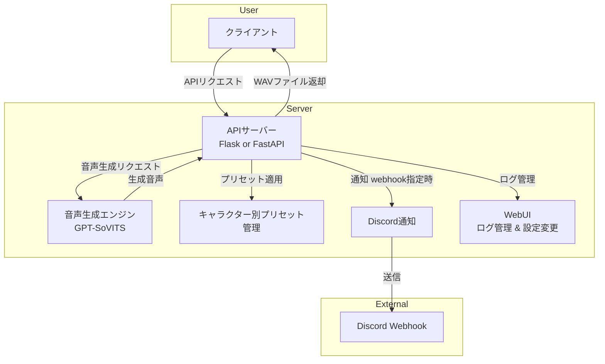

# **HLD（High-Level Design : 基本設計）**  
**プロジェクト名:** GPT-SoVITS 音声生成 API  
**作成日:** 2025年3月12日  
**バージョン:** 1.0  
**作成者:** sora-kisaragi  

---

## **1. システム概要**  

本システムは、GPT-SoVITS を用いた音声生成 API を提供し、以下の機能を実現する。  

### **主要機能**  
1. **音声生成（WAV出力）**
2. **音声ストリーミング（リアルタイム再生）**
3. **キャラクターごとのプリセット管理**
4. **WebUI でのログ管理 & 設定変更**
5. **Discord Webhook 通知（オプション）**

---

## **2. システム構成図**  

---

## **3. API エンドポイント構成**  

### **3.1 音声生成 API**
- **エンドポイント:** `/generate`
- **メソッド:** `POST`
- **入力パラメータ:**
  - `text`（音声にするテキスト）
  - `character`（キャラクター名）
  - `preset`（適用するプリセット名、オプション）
  - `webhook_url`（通知用 Webhook、オプション）
- **出力:** WAV 音声ファイル  

---

### **3.2 音声ストリーミング API**
- **エンドポイント:** `/stream`
- **メソッド:** `POST`
- **入力パラメータ:**
  - `text`（音声にするテキスト）
  - `character`（キャラクター名）
  - `preset`（適用するプリセット名、オプション）
- **出力:** チャンクエンコーディングされた WAV データ（リアルタイム配信）  

---

### **3.3 プリセット一覧取得 API**
- **エンドポイント:** `/presets`
- **メソッド:** `GET`
- **出力:** キャラクターごとのプリセットリスト  

---

### **3.4 キャラクターごとの設定変更 API**
- **エンドポイント:** `/settings`
- **メソッド:** `POST`
- **入力パラメータ:**
  - `character`（対象キャラクター）
  - `default_preset`（デフォルトのプリセット）
  - `default_speed`（デフォルトの話速）
  - `default_emotion`（デフォルトの感情パラメータ）
- **出力:** 設定変更の確認レスポンス  

---

### **3.5 Discord Webhook 通知 API**
- **エンドポイント:** `/generate` または `/stream`
- **メソッド:** `POST`
- **トリガー:** `webhook_url` を指定した場合のみ送信
- **出力:** Discord Webhook への通知メッセージ  

---

## **4. システムコンポーネント**
| コンポーネント | 説明 |
|-------------|--------------------------------|
| API サーバー | クライアントからのリクエストを処理 |
| 音声生成エンジン | GPT-SoVITS にリクエストを送り、音声を生成 |
| プリセット管理 | キャラクターごとの設定値を管理 |
| WebUI | 設定変更・ログ管理を提供 |
| Discord 通知 | Webhook を利用して通知を送信 |

---

## **5. データフロー**  

1. クライアントが `/generate` もしくは `/stream` にリクエストを送信  
2. API サーバーがリクエストを処理し、音声生成エンジンに転送  
3. 音声生成エンジンがテキストを WAV 音声に変換  
4. API サーバーが音声をクライアントへ返却（またはストリーミング）  
5. Webhook 指定時は Discord Webhook に通知を送信  

---

## **6. 変更履歴**
| 日付 | 変更内容 | バージョン |
|----|------|------|
| 2025-03-07 | 初版作成 | 1.0 |

---