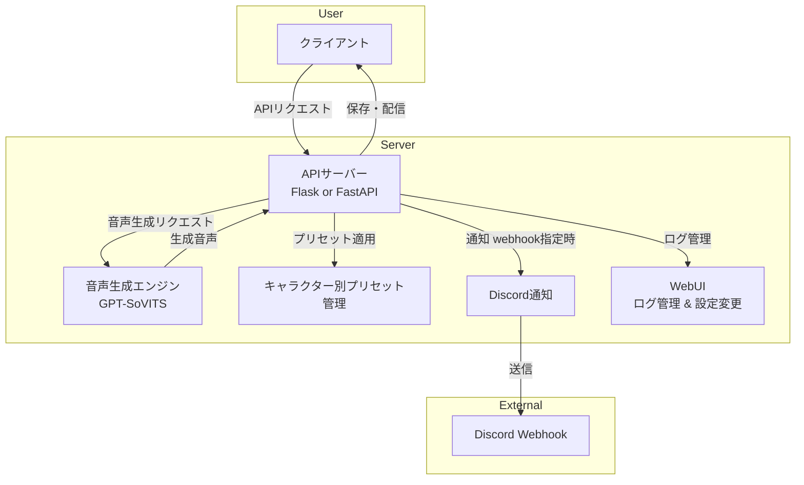

## **RDD 要件定義書**  
**プロジェクト名:** GPT-SoVITS 音声生成 API  
**作成日:** 2025年3月8日  
**バージョン:** 1.1  
**作成者:** sora-kisaragi  

---

## **1. 目的**  
本システムは、GPT-SoVITS を活用した音声生成 API を提供する。  
以下の機能を提供し、テキストを音声に変換し、リアルタイムまたはバッチで利用可能とする。  

### **主要機能:**  
- **音声生成 (WAV 出力)**  
- **音声ストリーミング (リアルタイム再生)**  
- **キャラクターごとのプリセット管理**  
- **WebUI でのログ管理 & 設定変更**  
- **Discord Webhook での通知**  

---

## **2. システム概要**  

### **2.1 システム構成**

---

## **3. 機能要求**

### **3.1 音声生成**
| No | 項目 | 内容 |
|----|------|------|
| 1 | 機能 | 入力テキストから音声（WAV）を生成する |
| 2 | API エンドポイント | `/generate` |
| 3 | HTTP メソッド | `POST` |
| 4 | 入力 | `text`（テキスト）`character`（キャラクター）`preset`（プリセット） |
| 5 | 出力 | WAV 音声データ |
| 6 | Webhook通知 | 指定時のみ Discord Webhook へ送信 |

### **3.2 音声ストリーミング**
| No | 項目 | 内容 |
|----|------|------|
| 1 | 機能 | 音声をリアルタイムでストリーミング配信 |
| 2 | API エンドポイント | `/stream` |
| 3 | HTTP メソッド | `POST` |
| 4 | 入力 | `text` `character` `preset` |
| 5 | 出力 | チャンクエンコーディングされた WAV データ |

### **3.3 キャラクター別プリセット管理**
| No | 項目 | 内容 |
|----|------|------|
| 1 | 機能 | キャラクターごとのプリセット一覧取得 |
| 2 | API エンドポイント | `/presets` |
| 3 | HTTP メソッド | `GET` |
| 4 | 出力 | キャラクターごとのプリセットリスト |

### **3.4 キャラクターごとの設定変更**
| No | 項目 | 内容 |
|----|------|------|
| 1 | 機能 | キャラクターごとにデフォルトプリセットを変更 |
| 2 | API エンドポイント | `/settings` |
| 3 | HTTP メソッド | `POST` |
| 4 | 入力 | `character` `default_preset` `default_speed` `default_emotion` |

### **3.5 Discord Webhook 通知**
| No | 項目 | 内容 |
|----|------|------|
| 1 | 機能 | 生成完了時に Discord Webhook へ通知 |
| 2 | トリガー | `/generate` または `/stream` で `webhook_url` を指定した場合のみ |
| 3 | 出力 | Discord Webhook メッセージ |

---

## **4. 非機能要求**
| No | 項目 | 内容 |
|----|------|------|
| 1 | パフォーマンス | 音声生成は 3 秒以内に開始されること |
| 2 | 拡張性 | キャラクター・プリセットの追加が容易であること |
| 3 | 可用性 | WebUI でプリセットの設定を変更可能 |
| 4 | セキュリティ | 外部アクセスは認証付きで制限 |

---

## **5. 開発ロードマップ**
| No | タスク | 状態 |
|----|-------|------|
| 1 | API の基本設計 | ✅ 完了 |
| 2 | `/generate` 実装 | ⬜ 未実装 |
| 3 | `/stream` 実装 | ⬜ 未実装 |
| 4 | `/presets` 実装 | ⬜ 未実装 |
| 5 | `/settings` 実装 | ⬜ 未実装 |
| 6 | Discord Webhook 実装 | ⬜ 未実装 |
| 7 | WebUI の開発 | ⬜ 未実装 |

---

## **6. 変更履歴**
| 日付 | 変更内容 | バージョン |
|----|------|------|
| 2025-03-12 | 初版作成 | 1.0 |

---