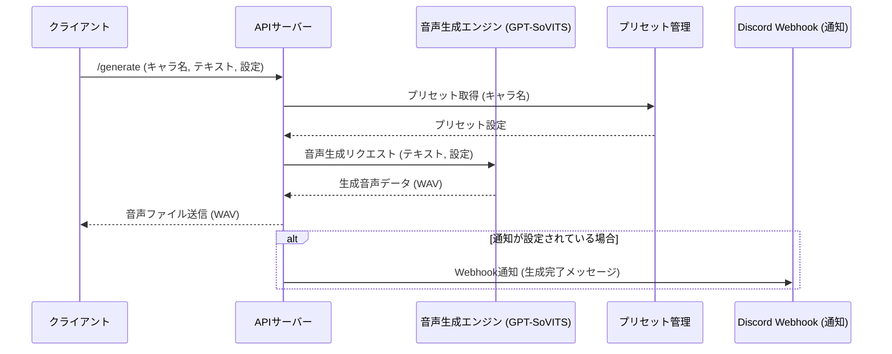

# SoVITS Addon API シーケンス図

このドキュメントでは、SoVITS Addon APIの主要な処理フローをシーケンス図で説明します。

## 音声生成フロー (/generate エンドポイント)



## 解説
1. クライアントが ```/generate API``` を呼び出し、キャラクター名とテキストを送信。
2. API サーバーは プリセット管理システム から キャラクターごとの設定 を取得。
3. 取得した設定とリクエストの情報をもとに、音声生成エンジン（GPT-SoVITS）にリクエスト送信。
4. エンジンが音声データを生成し、API に WAV ファイルを返す。
5. API はクライアントに音声ファイルを返却。
6. 通知が設定されている場合のみ、Discord Webhook に通知を送信。
